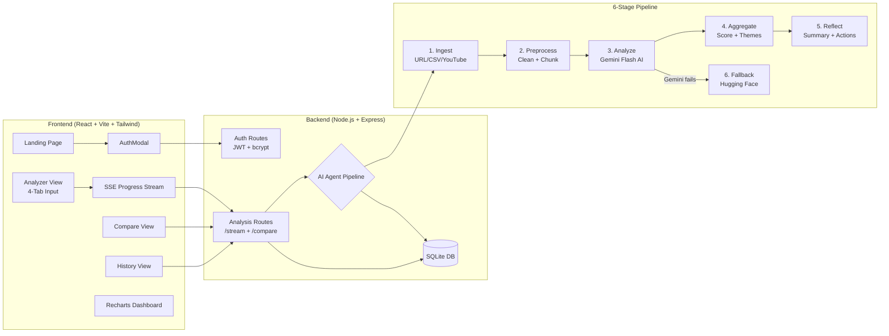

# SentiAgent

> AI-powered Sentiment Intelligence Platform — analyze sentiment, emotions, sarcasm, and key themes in text, URLs, CSV datasets, and YouTube comments.

[](LICENSE)

---

## Architecture



---

## Tech Stack

| Layer     | Technology                                       |
|-----------|--------------------------------------------------|
| Frontend  | React 18 + Vite 5 + Tailwind CSS 3 + Recharts    |
| Backend   | Node.js 20+ + Express 4                          |
| Auth      | JWT (httpOnly cookies) + bcryptjs                |
| Database  | SQLite via native `node:sqlite` (no compilation) |
| AI Model  | Google Gemini Flash (primary)                    |
| Fallback  | Hugging Face Inference API                       |
| Streaming | Server-Sent Events (SSE) 5-stage pipeline        |

---

## Features

- ✅ **Multi-source ingestion** — Text, URL, CSV upload, YouTube video comments
- ✅ **Real-time SSE streaming** — 5-stage progress (Ingest → Clean → Analyze → Aggregate → Reflect)
- ✅ **Rich analytics** — Sentiment score ring, emotion radar, pie chart, aspect bar chart
- ✅ **Sarcasm & irony detection** — Flags and explains sarcastic items
- ✅ **Executive AI summary** — 3 prioritized recommended actions from Gemini
- ✅ **Compare Mode** — Side-by-side analysis of two texts with winner calculation
- ✅ **History** — All analyses saved per account with search and filter
- ✅ **CSV / PDF export** — Download individual or all analyses
- ✅ **Dark / Light mode** — Persistent theme toggle
- ✅ **Rate limiting** — Auth (20/15m), Analysis (10/1m), General (150/15m)
- ✅ **Exponential backoff** — Automatic Gemini retry with model fallback chain

---

## Project Structure

```
Flexi CA3/
├── sample_reviews.csv        # 50 mixed reviews with sarcasm for testing
├── README.md
├── .gitignore
├── client/                   # React frontend
│   ├── index.html
│   ├── vite.config.js
│   ├── tailwind.config.js
│   └── src/
│       ├── App.jsx
│       ├── main.jsx
│       ├── index.css
│       ├── context/
│       │   └── AuthContext.jsx
│       ├── components/
│       │   ├── Navbar.jsx
│       │   ├── AuthModal.jsx
│       │   ├── AnalyzerPanel.jsx
│       │   ├── ProgressBar.jsx
│       │   ├── ResultsDashboard.jsx
│       │   ├── HistoryDrawer.jsx
│       │   ├── Charts.jsx
│       │   └── Toast.jsx
│       ├── pages/
│       │   ├── LandingPage.jsx
│       │   ├── AnalyzerView.jsx
│       │   ├── CompareView.jsx
│       │   └── HistoryView.jsx
│       └── utils/
│           └── api.js
└── server/                   # Express backend
    ├── test-unit.js
    ├── package.json
    └── src/
        ├── server.js
        ├── config/
        │   ├── db.js
        │   └── env.js
        ├── middleware/
        │   ├── auth.js
        │   ├── errorHandler.js
        │   └── upload.js
        ├── routes/
        │   ├── authRoutes.js
        │   ├── analysisRoutes.js
        │   └── statusRoutes.js
        └── services/
            ├── agentPipeline.js
            ├── geminiService.js
            ├── huggingFaceService.js
            ├── preprocessService.js
            ├── ingestionService.js
            └── youtubeService.js
```

---

## Getting Started

### Prerequisites

- Node.js 20+ 
- API keys for Gemini, Hugging Face, and YouTube Data API v3

### 1. Clone and install

```bash
# Install server dependencies
cd server && npm install

# Install client dependencies
cd ../client && npm install
```

### 2. Configure environment

Create `server/.env`:

```env
PORT=5000
JWT_SECRET=your-super-secret-jwt-key
GEMINI_API_KEY=your-gemini-api-key
HUGGING_FACE_API_KEY=your-hf-api-key
YOUTUBE_API_KEY=your-youtube-api-key
GEMINI_MODEL=gemini-3.6-flash
```

### 3. Run

```bash
# Terminal 1 — Backend
cd server && npm run dev

# Terminal 2 — Frontend
cd client && npm run dev
```

Visit **http://localhost:5173**

### 4. Run unit tests

```bash
cd server && node test-unit.js
```

### 5. Test with sample CSV

Upload `sample_reviews.csv` (50 reviews) on the CSV tab.

---

## API Reference

| Method | Endpoint                    | Auth | Description                        |
|--------|-----------------------------|------|------------------------------------|
| POST   | `/api/auth/signup`          | ✗    | Register with email + password      |
| POST   | `/api/auth/login`           | ✗    | Login, sets httpOnly cookie         |
| POST   | `/api/auth/logout`          | ✓    | Clear session                       |
| GET    | `/api/auth/me`              | ✓    | Get current user                    |
| POST   | `/api/analyses`             | ✓    | Run synchronous analysis            |
| POST   | `/api/analyses/stream`      | ✓    | Run SSE streaming analysis          |
| POST   | `/api/analyses/compare`     | ✓    | Compare two texts                   |
| GET    | `/api/analyses`             | ✓    | List user's analyses                |
| GET    | `/api/analyses/:id`         | ✓    | Get single analysis                 |
| DELETE | `/api/analyses/:id`         | ✓    | Delete analysis                     |
| GET    | `/api/status`               | ✗    | Health check + feature flags        |

---

## Security Checklist

- [x] All API keys in `server/.env`, never in client code  
- [x] JWT stored in httpOnly cookie (not localStorage)  
- [x] bcryptjs with 12 rounds for password hashing  
- [x] Auth middleware on all `/api/analyses` routes  
- [x] Rate limiting (express-rate-limit) on all endpoints  
- [x] CORS restricted to localhost origins  
- [x] File uploads validated by type and size  
- [x] `.env` and `sentiagent.db` in `.gitignore`

---

## License

MIT — Free to use and modify.
